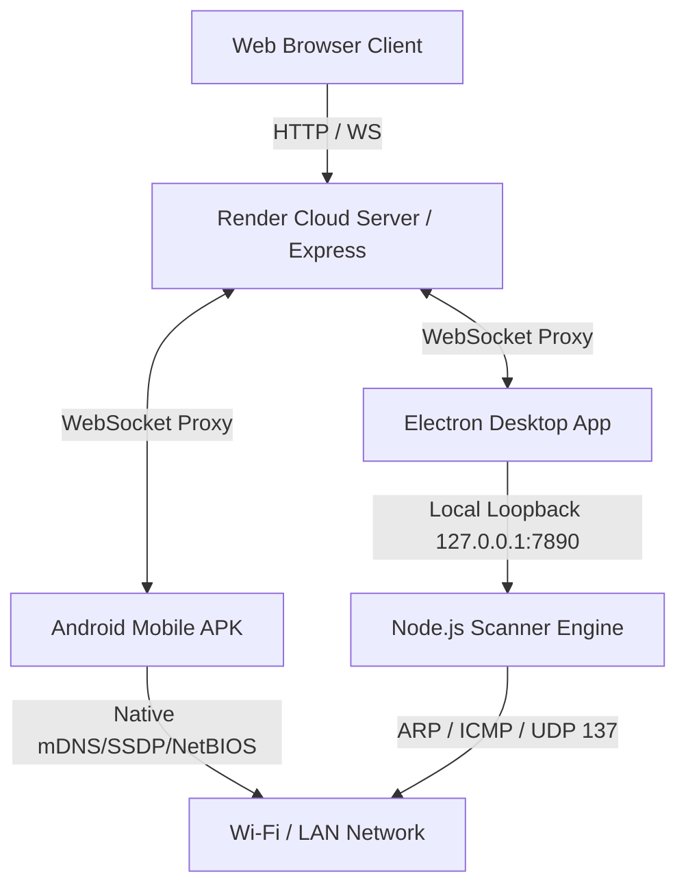
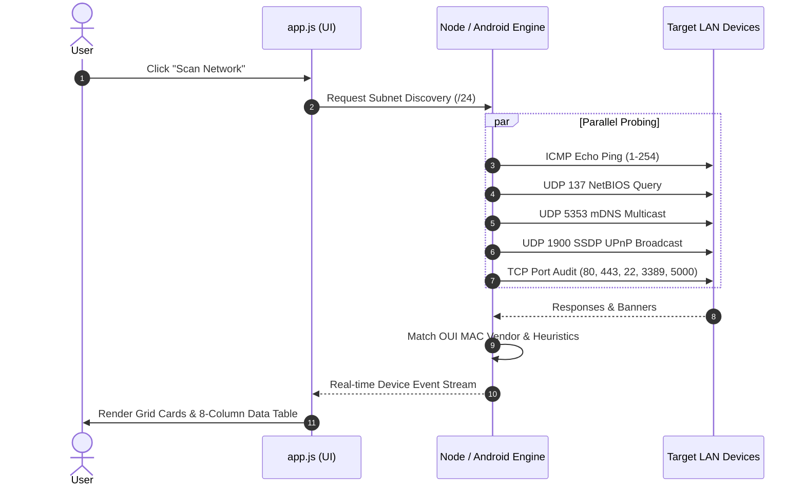
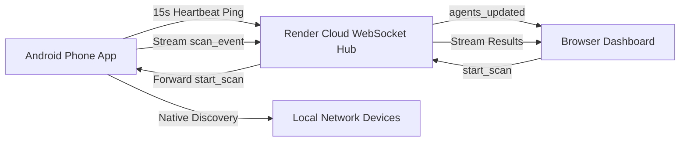

# System Architecture & Technical Specifications

This document details the high-level architecture, module interaction topology, and execution sequence of **DOM IP Scanner**.

---

## 🏗️ 1. High-Level System Topology

---

## ⚡ 2. Parallel Network Scanning Sequence

---

## 📱 3. Mobile Agent & Cloud Synchronization Architecture

